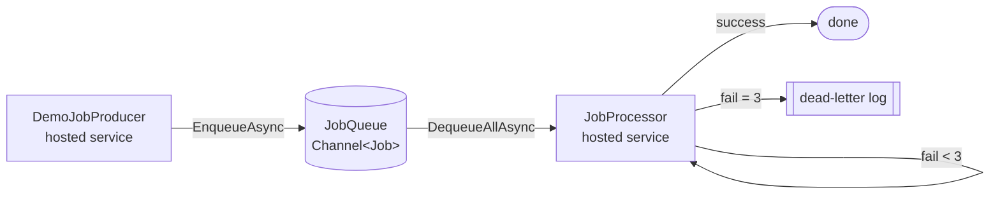

# 06 · Background Job Runner

> **Intermediate project** · Focus: **Hosted services**, **`System.Threading.Channels`**, and **retries**.

A worker app that runs background jobs off an in-memory queue. One hosted service
**produces** jobs, another **consumes** them — retrying transient failures with
exponential backoff and dead-lettering the ones that never succeed.

---

## What you'll learn

| Concept | Where to look |
|---|---|
| `BackgroundService` / `IHostedService` (always-on workers) | [`JobProcessor.cs`](src/JobRunner/JobProcessor.cs), [`DemoJobProducer.cs`](src/JobRunner/DemoJobProducer.cs) |
| Producer/consumer with a bounded `Channel<T>` (back-pressure) | [`JobQueue.cs`](src/JobRunner/JobQueue.cs) |
| Retry with a max-attempt cap + exponential backoff | [`JobProcessor.cs`](src/JobRunner/JobProcessor.cs) |
| Dead-lettering permanently-failing jobs | [`JobProcessor.cs`](src/JobRunner/JobProcessor.cs) |
| Graceful shutdown with `IHostApplicationLifetime` | [`JobProcessor.cs`](src/JobRunner/JobProcessor.cs) |
| The Generic Host + DI (`Host.CreateApplicationBuilder`) | [`Program.cs`](src/JobRunner/Program.cs) |

---

## Run it

```bash
cd "06 - Background Job Runner"
dotnet run --project src/JobRunner
```

You'll see the producer enqueue 10 jobs while the processor works through them.
Because failures are simulated (~40%), you'll see retries and the occasional
dead-letter. Sample output:

```
📥 Enqueued job 1 'send-email-1'
✅ Job 1 'send-email-1' succeeded on attempt 1
⚠️  Job 2 attempt 1 failed: transient downstream error (simulated). Retrying in 200ms
✅ Job 2 'send-email-2' succeeded on attempt 2
💀 Job 7 'send-email-7' failed after 3 attempts: ... Dead-lettered.
All jobs drained. Shutting down.
```

The app exits on its own once every job has been processed.

---

## How the pieces fit



**Channels** give you a thread-safe, async queue with **back-pressure**: the queue
is bounded (100), so if the consumer falls behind, producers *await* instead of
ballooning memory. **Hosted services** are the always-on workers that start with
the app. **Retries** are capped (3 attempts) with exponential backoff so a broken
downstream isn't hammered, and anything still failing is dead-lettered for a human.

> In production the queue is usually a real broker (Azure Service Bus, RabbitMQ),
> but the *shape* — enqueue, consume, retry, dead-letter — is exactly this.

---

## 🤖 Try these prompts with your AI assistant

**Scale out the consumer:**
> "Run N parallel consumers reading from the same channel (configurable via
> `WorkerCount`). Explain why `SingleReader` must change and what ordering
> guarantees I lose. Show the plan first."

**Add jitter + a real policy:**
> "Replace my hand-rolled retry with Polly's `ResiliencePipeline`, using
> exponential backoff WITH jitter and a circuit breaker. Keep the dead-letter
> behaviour and explain each policy."

**Turn it into an API:**
> "Add a Minimal API `POST /jobs` that enqueues a job onto the existing
> `JobQueue`, so work is submitted over HTTP. Keep the hosted consumer unchanged."

**Practise the review skill:**
> "Review `ProcessWithRetryAsync` for cancellation correctness and exception
> handling. What happens on shutdown mid-retry? List issues before any code."

> 💡 **The mindset:** ask for a *plan before edits*, give *outcomes + constraints*,
> and make sure you understand what happens to a job on shutdown.

---

## Next

That's the **Intermediate** tier done 🎉 — up next is the **Advanced** tier:
AI Support Chatbot, Docs Q&A with RAG, and a Smart Invoice Parser.
