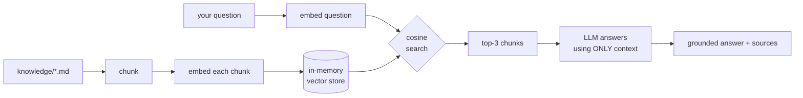

# 08 · Docs Q&A with RAG

> **Advanced project** · Focus: **Embeddings** + **vector search** (RAG).

Ask questions about a small knowledge base and get answers **grounded in those
documents** — not the model's imagination. This is Retrieval-Augmented Generation
built from scratch: chunk → embed → vector-search → generate. The vector store is
in-memory, so there's **no database to set up**.

---

## What you'll learn

| Concept | Where to look |
|---|---|
| Chunking documents for retrieval quality | [`Services/DocumentChunker.cs`](src/DocsQa/Services/DocumentChunker.cs) |
| Generating **embeddings** with `IEmbeddingGenerator` | [`Services/RagPipeline.cs`](src/DocsQa/Services/RagPipeline.cs) |
| **Vector search** via cosine similarity (`TensorPrimitives`) | [`Services/InMemoryVectorStore.cs`](src/DocsQa/Services/InMemoryVectorStore.cs) |
| The full RAG pipeline (retrieve → ground → generate) | [`Services/RagPipeline.cs`](src/DocsQa/Services/RagPipeline.cs) |
| Reducing hallucination with a grounded prompt | [`Services/RagPipeline.cs`](src/DocsQa/Services/RagPipeline.cs) |
| Showing sources for trust + debugging | [`Program.cs`](src/DocsQa/Program.cs) |

---

## Prerequisites

**[Ollama](https://ollama.com)** running locally with both models pulled:

```bash
ollama pull all-minilm    # embeddings (small + fast)
ollama pull llama3.2      # answer generation
```

---

## Run it

```bash
cd "08 - Docs Q&A with RAG"
dotnet run --project src/DocsQa
```

It embeds the three docs in [`src/DocsQa/knowledge`](src/DocsQa/knowledge), then
lets you ask questions:

```
Question: which region is the default when I deploy?
Answer: By default a web app deploys to US-East [deployments.md]...

Retrieved from:
  • deployments.md (similarity 0.681)
  • overview.md (similarity 0.503)
  • pricing.md (similarity 0.402)
```

Ask something **not** in the docs ("what's the capital of France?") and it should
answer *"I don't know based on the provided documents."* — that's RAG doing its job.

---

## How RAG works here



- **Embeddings** turn text into vectors where *similar meaning → similar direction*.
- **Vector search** finds the chunks whose vectors point most like the question's
  (cosine similarity). No keyword matching — it works on meaning.
- **Generation** hands those chunks to the LLM with a strict "use only this
  context" instruction, so answers stay grounded and citable.

> The existing **[RAG Basics](../RAG%20Basics)** project stores vectors in Postgres
> with pgvector. This one keeps them in memory to stay dependency-free — same idea,
> different store.

---

## 🤖 Try these prompts with your AI assistant

**Upgrade the vector store:**
> "Replace `InMemoryVectorStore` with pgvector using Npgsql, keeping the same
> `Search(topK)` contract. Explain the SQL for a cosine-distance query and the
> index I should add."

**Improve retrieval:**
> "Add a similarity threshold so low-scoring chunks are dropped before they reach
> the prompt, and fall back to 'I don't know' when nothing clears the bar. Explain
> how to pick the threshold."

**Add citations properly:**
> "Return structured citations (source + the exact sentence used) alongside the
> answer, and render them as footnotes. Plan the data flow before coding."

**Practise the review skill:**
> "Review my chunking strategy. For these docs, what chunk size and overlap would
> improve retrieval, and why? Show measurements I could run to compare."

> 💡 **The mindset:** ask for a *plan before edits*, give *outcomes + constraints*,
> and always inspect the retrieved chunks — bad answers usually mean bad retrieval.

---

## Next

Move on to **[09 · Smart Invoice Parser](../09%20-%20Smart%20Invoice%20Parser)** — structured output, validating AI answers.
