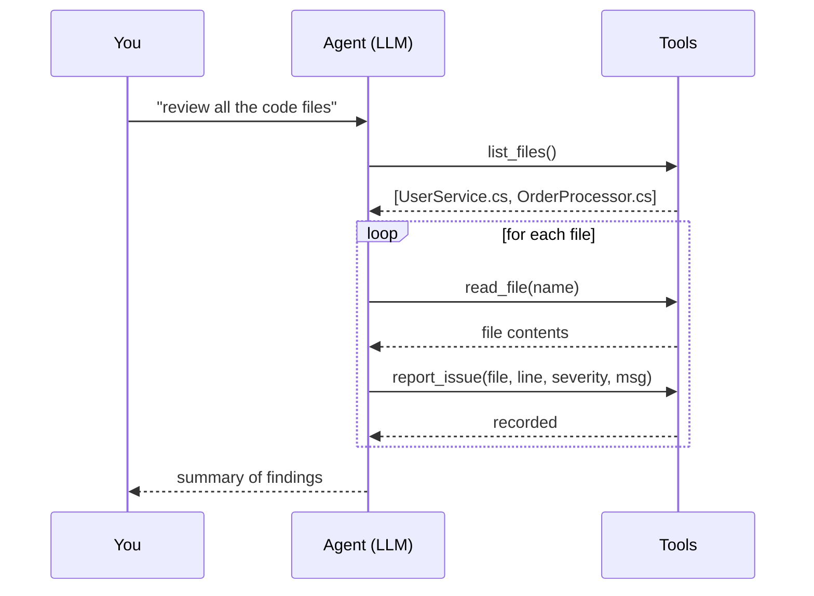

# 11 · AI Code Review Agent

> **Expert project** · Focus: **The agent loop** + **tool calling**.

An agent that reviews C# files on its own. You give it a goal ("review the code")
and a set of **tools** (list files, read a file, report an issue) — then the LLM
decides which tools to call, in what order, until the job is done. That
decide→act→observe→repeat cycle is the **agent loop**, and
`Microsoft.Extensions.AI` runs it for you.

---

## What you'll learn

| Concept | Where to look |
|---|---|
| Defining **tools** the model can call | [`ReviewTools.cs`](src/CodeReviewAgent/ReviewTools.cs) |
| The **agent loop** via `UseFunctionInvocation()` | [`Program.cs`](src/CodeReviewAgent/Program.cs) |
| Registering tools with `AIFunctionFactory.Create` | [`Program.cs`](src/CodeReviewAgent/Program.cs) |
| Sandboxing file access (path-traversal guard) | [`ReviewTools.cs`](src/CodeReviewAgent/ReviewTools.cs) |
| Collecting structured results from tool calls | [`Program.cs`](src/CodeReviewAgent/Program.cs) |

---

## Prerequisites

**[Ollama](https://ollama.com)** running locally with a **tool-capable** model:

```bash
ollama pull llama3.2
```

> Not every model supports function calling. `llama3.2`, `qwen2.5`, and
> `mistral-nemo` do. If the agent never calls a tool, your model probably can't.

---

## Run it

```bash
cd "11 - AI Code Review Agent"
dotnet run --project src/CodeReviewAgent
```

It first prints the files it *can* review (a no-AI sanity check that the tools are
wired), then runs the agent, which reviews the two intentionally-flawed files in
[`src/CodeReviewAgent/sample`](src/CodeReviewAgent/sample) and reports issues like:

```
UserService.cs
  [Critical] line 12: SQL injection — user input concatenated into the query...
  [Warning]  line 16: new HttpClient() per call risks socket exhaustion...
  [Warning]  line 24: empty catch swallows the exception...

OrderProcessor.cs
  [Warning]  line 9:  .Result blocks / can deadlock — await FetchAsync()...
  [Info]     line 14: string concatenation in a loop — use StringBuilder...
```

---

## How the agent loop works



The key: **you don't script these steps.** You hand the model the tools and the
goal; it plans and executes the calls itself. `UseFunctionInvocation()` is the
middleware that executes each requested tool and feeds the result back into the
conversation so the model can decide what to do next.

> This is exactly how coding assistants (Copilot, Claude Code) work under the hood
> — an agent loop over a set of tools.

---

## 🤖 Try these prompts with your AI assistant

**Give the agent more power (carefully):**
> "Add a `run_analyzer` tool that shells out to `dotnet format --verify-no-changes`
> and feeds the output back to the model. Sandbox it and explain the risks of
> letting an agent run commands."

**Make output CI-friendly:**
> "Have the agent write findings to a SARIF file so they show up as GitHub code
> scanning alerts. Keep the tool-calling flow unchanged."

**Add a review rubric:**
> "Extend the system prompt so the agent scores each file against a rubric
> (security, performance, readability) and reports the score via a new tool."

**Practise the review skill:**
> "Review my `ReviewTools` for safety. Is the path-traversal guard sufficient?
> What if `read_file` is asked for a 1 GB file? List issues before code."

> 💡 **The mindset:** ask for a *plan before edits*, give *outcomes + constraints*,
> and treat every tool you hand an agent as attack surface — sandbox it.

---

## Next

Move on to **[12 · AI App in Production](../12%20-%20AI%20App%20in%20Production)** — evals, token costs, OpenTelemetry.
